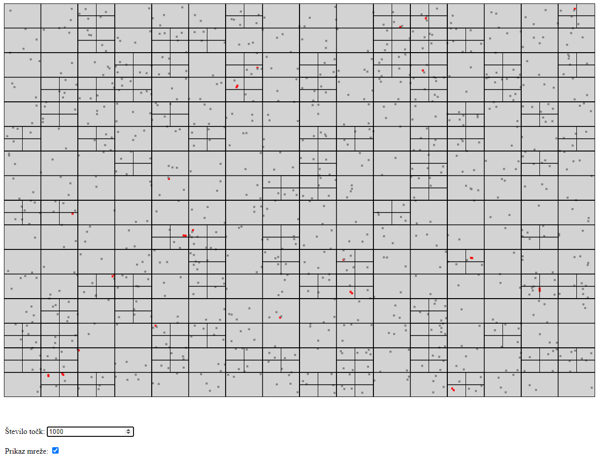

# Quad-tree-simulation
A simulation of collision detection using the Quad-tree technique.

Try the application with this link: [https://markloboda.github.io/Quad-tree-simulation/](https://markloboda.github.io/Quad-tree-simulation/)

Preview for the app:

